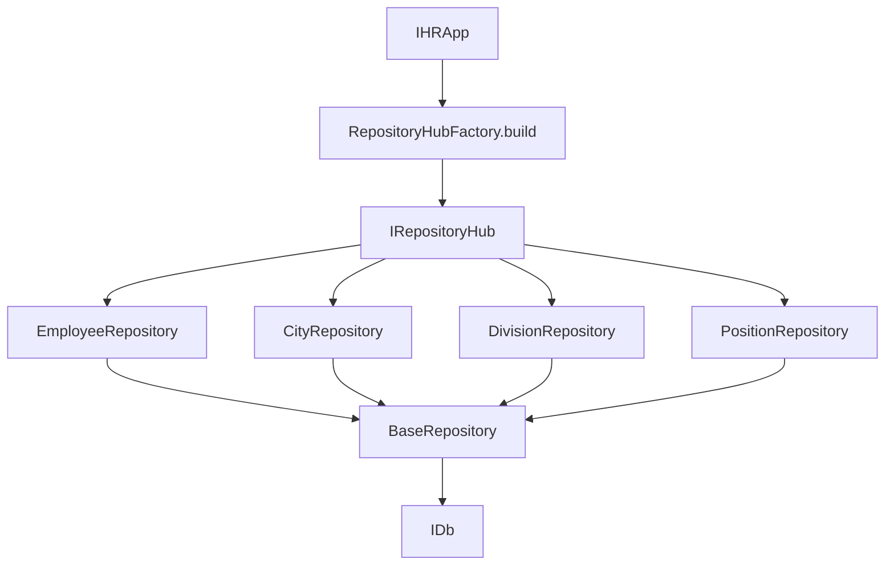

# Архитектурное решение микросервиса HR

## Обзор

Данная архитектура разработана для микросервиса управления персоналом (HR) с учетом контекста: большое количество операций чтения, редкие операции записи, документоориентированная база данных как узкое место производительности.

### Основные компоненты

- **Repository Pattern**: Инкапсуляция логики доступа к данным
- **Factory Pattern**: Создание репозиториев через фабрику
- **NVI Pattern**: Контроль выполнения операций через базовый класс
- **Денормализация**: Оптимизация чтения за счет хранения связанных данных

## Используемые паттерны

### 1. Repository

**Интерфейс `IRepository`** определяет контракт для работы с данными.

**Абстрактный класс `BaseRepository`** предоставляет базовую реализацию.

**Конкретные репозитории** наследуются и добавляют специфичную логику.

### 2. Factory

**`RepositoryHubFactory`** создает все репозитории и возвращает их в виде агрегата `IRepositoryHub`.

### 3. NVI (Non-Virtual Interface)

**Базовый класс контролирует процесс**, предоставляя публичные методы, которые вызывают парные protected методы.

Это позволяет базовому классу:
- Контролировать последовательность операций;
- Добавлять общую логику (логирование, валидация, базовая обработка исключений);
- Обеспечивать консистентность поведения.

## Текущее решение (Read-Heavy)

### Денормализация данных

Для оптимизации чтения используется денормализация - связанные данные хранятся непосредственно в документе сотрудника.

### Преимущества для read-heavy сценария

1. **Быстрое чтение**: Метод `employeeWithCityList` выполняет один запрос к базе
2. **Масштабируемость чтения**: База данных может эффективно кешировать документы (требует дополнительной реализации в рамках существующих контрактов).

### Архитектура репозиториев

## Решения для Write-Heavy сценария

### 1. Ленивая денормализация (или отключение денормализации вовсе)

Илдея в обновлении денормализованных полей не при записи, а при чтении.

**Преимущества**:
- Запись становится быстрее (нет дополнительных чтений связанных данных)
- Уменьшается нагрузка на базу при частых записях

Реализация с помощью альтернативного класса, имплементирующего соответствующий IRepository, и подключение его в агрегат в фабричном методе.

### 2. Отложенные обновления связанных документов

При изменении связанной сущности (город, должность, отдел) не обновлять сразу все денормализованные поля во всех документах сотрудников. Вместо этого создавать очередь обновлений, обновлять в фоне и т.п.

## Резюме

Текущее решение оптимально для read-heavy сценария благодаря денормализации данных и управления консистентностью данных с помощью соответствующих паттернов (Repository). Для write-heavy сценария предлагаются альтернативные реализации тех же интерфейсов с ленивой денормализацией или ее отсутствием, а также отложенные обновления для поддержания консистентности данных.

Выбор между стратегиями потенциально осуществляется через `RepositoryHubFactory` по заданным условиям.